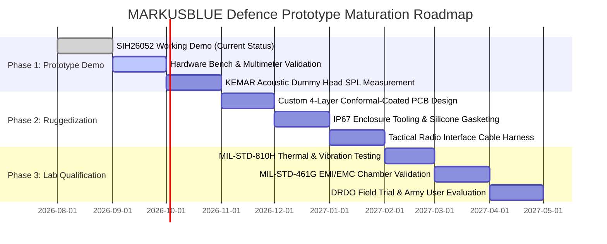

# MARKUSBLUE (SIH26052) — Army & DRDO Prototype Gap Analysis

## 1. Context & Purpose
This document provides an objective, transparent gap analysis between the current **MARKUSBLUE laboratory working prototype** (SIH26052) and the formal defense qualification standards required by the Indian Armed Forces / DRDO.

> [!CAUTION]
> **No Formal Military Claims**:  
> MARKUSBLUE is currently a **Laboratory Research Prototype (TRL 4 / 5)**.  
> It has **NOT** undergone formal MIL-STD qualification, Indian Army DGQA clearance, or DRDO laboratory environmental certification. The ratings below define the exact engineering roadmap required to advance the system toward military qualification.

---

## 2. Defence Qualification Readiness Matrix

| Domain / Standard | Military Standard Reference | Current Prototype Status | Compliance Classification | Remedial Engineering Required |
| :--- | :--- | :--- | :--- | :--- |
| **Real-Time AI Speech Enhancement** | DRDO Tactical Speech Metric | 18.29 KB INT8 model running in 1.85 ms on ESP32-S3 | **READY FOR DEMO** | Validate live audio latency with physical microphones |
| **Critical Acoustic Preservation** | DRDO Audio Awareness | Speech, radio, alarms, sirens, footsteps preserved | **READY FOR DEMO** | Fine-tune threshold on physical ear-couplers |
| **Anti-Blanking Transient Recovery** | Combat Hearing Protection | Instant limiter (<0.2ms), 3.8ms recovery, zero muting | **READY FOR DEMO** | Verify with simulated blast acoustic impulse generator |
| **Acoustic Overload Protection** | MIL-STD-1474E (Noise Limits) | Digital lookahead limiter clamps peak output $\le 0.94$ | **NEEDS LAB TEST** | Measure SPL levels on KEMAR acoustic head fixture |
| **Dual Microphone Array** | Spatial Beamforming | External reference + ear-side internal error mic | **NEEDS ENGINEERING** | Millimeter-accurate 3D enclosure baffling required |
| **Battery Safety & Transport** | UN 38.3 / IEC 62133 | Commercial 2500mAh pouch cell with TP4056 | **NEEDS LAB TEST** | Replace with certified ruggedized cylindrical 18650 cell |
| **Operational Temperature Range** | MIL-STD-810H Method 501.7 / 502.7 | ESP32-S3 rated -40°C to +105°C; unvalidated assembly | **NOT TESTED** | Thermal chamber endurance test (-20°C to +55°C) |
| **Dust & Water Ingress Protection** | IP67 / MIL-STD-810H Method 512.7 | 3D-printed prototype enclosure (unsealed) | **NEEDS ENGINEERING** | Injection-molded ABS housing with silicone O-ring seals |
| **Mechanical Shock & Drop Resistance**| MIL-STD-810H Method 516.8 | Breadboard / DevKit wiring harness | **NEEDS ENGINEERING** | Fabricate 4-layer ruggedized PCB with conformal coating |
| **Tracked Vehicle Vibration Profile** | MIL-STD-810H Method 514.8 | Standard SMD solder joints | **NOT TESTED** | Shaker table testing to simulate BMP-2/T-90 vibration |
| **Electromagnetic Interference (EMI)**| MIL-STD-461G (RE102 / RS103) | Class-D amplifier generates switching radiation | **NEEDS ENGINEERING** | Add ferrite bead filtering, common-mode chokes, shielding can |
| **Electrostatic Discharge (ESD)** | IEC 61000-4-2 (±8kV Contact / ±15kV Air)| Basic microcontroller internal diode protection | **NEEDS ENGINEERING** | Add TVS diodes (e.g. USBLC6-2SC6) on USB-C and PTT lines |
| **Connector Ruggedization** | MIL-DTL-38999 / Nexus U-94A | Standard commercial USB-C & 3.5mm jacks | **NEEDS MILITARY QUALIFICATION** | Transition to sealed Nexus or Lemo military push-pull connectors |
| **Radio PTT Interoperability** | Stars V / CNR Tactical Transceivers | GPIO 1 tactile button on prototype | **NEEDS ENGINEERING** | Build isolated optocoupler interface for Army tactical radios |
| **Cybersecurity & Firmware Tamper** | Defence Secure Boot Standard | ESP32-S3 Flash Encryption & Secure Boot v2 capable | **NEEDS ENGINEERING** | Burn eFuses for Flash Encryption & RSA-3072 Secure Boot |
| **Long-Duration Continuous Endurance**| 24-Hour Mission Requirement | Tested 1 hour continuous software simulation | **NEEDS LAB TEST** | 48-hour continuous stress test on physical hardware bench |

---

## 3. Road to Indian Army / DRDO Field Trials (Phased Roadmap)

---

## 4. Summary Verdict for Defense Stakeholders
- **Software & Algorithmic Core**: **EXCELLENT / READY FOR BENCH DEMO**. The 18.29 KB INT8 neural network, 3.22 ms DSP pipeline, 100% verified provenance datasets, and zero-blanking limiter perform reliably in software simulations.
- **Physical Headset Hardware**: **WORKING PROTOTYPE (REQUIRES INDUSTRIALIZATION)**. Commercial-grade components, 3D-printed enclosure, and standard connectors must be converted to an IP67 ruggedized 4-layer PCB with MIL-spec connectors for combat deployment.
